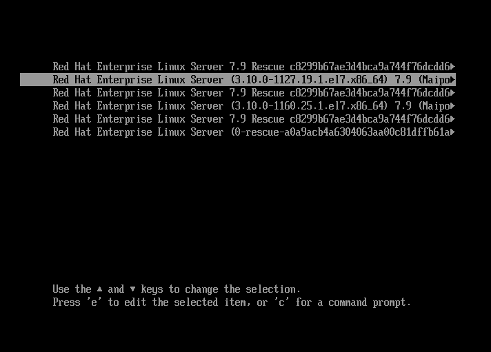

# Troubleshooting Linux Migration issues
This doc should help you resolve common issues when migrating VMs. This doc 
should apply to both Zerto and Startwind migrations.

## Networks

This is the most common problem with migrations. 

### First steps
Check the simple stuff:
* Correct network in HyperV
* Static MAC
* Run pre and/or post migration scripts

If all those are correct, these are the common problems

#### Udev file (RHEL 6 and 7)
Look at this file:  
```/etc/udev/rules.d/70-persistent-net.rules```

Ensure there aren't more entries than interfaces attached. 

If there are, you can remove this file and reboot to correct.
If not, then the networks may be swapped/

#### Swapped networks

Compare the MACs of each interface with the ones assigned in Hyper V 
**Properties -> hardware Configuration -> Network Adapters**.

```
# /sbin/ip addr
1: lo: <LOOPBACK,UP,LOWER_UP> mtu 65536 qdisc noqueue state UNKNOWN
    link/loopback 00:00:00:00:00:00 brd 00:00:00:00:00:00
    inet 127.0.0.1/8 scope host lo
2: eth0: <BROADCAST,MULTICAST,UP,LOWER_UP> mtu 1500 qdisc mq state UP qlen 1000
    link/ether 00:1d:d8:b7:1e:be brd ff:ff:ff:ff:ff:ff
    inet 10.4.25.6/24 brd 10.4.25.255 scope global eth0
3: eth1: <BROADCAST,MULTICAST,UP,LOWER_UP> mtu 1500 qdisc mq state UP qlen 1000
    link/ether 00:1d:d8:b7:1e:bf brd ff:ff:ff:ff:ff:ff
    inet 10.4.15.181/24 brd 10.4.15.255 scope global eth1
```
If the networks are swapped, the MAC and IP/Subnet will not agree with HyperV.
Simple change the **VM Network**. You should reboot, but won't always have to.

### Boot issues
If the VM has had it's pre-migration scripts run but fails to boot on HyperV 
troubleshoot with these steps

#### dracut error and prompt
If the VM boots with errors about **dracut** and gives you a console prompt
like this:
```
dracut:/#
```

Reboot the VM and look for the Grub boot loader. It has a short timer, so you
may have to be quick. I should look something like this:



You can select another kernel version and see if it will boot. Assuming it boots
you will have to remove and re-install the broken kernel. In this example **1160**
if the "**bad**" kernel, and you are booted into **1127**

**First**, verify networking is working. It is needed to install the kernel.

```
# rpm -qa |grep kernel-[0-9]
kernel-3.10.0-1160.25.1.el7.x86_64
kernel-3.10.0-1127.19.1.el7.x86_64
# yum remove -yq kernel-3.10.0-1160.25.1.el7
# yum install -yq kernel-3.10.0-1160.25.1.el7
```

Once this is complete, reboot.

#### No 2nd kernel to boot
If you are having the dracut error, but do **not** have a 2nd working kernel to
boot into you will need to boot from the ISO DVD.

- [ ] Add DVD instructions here


